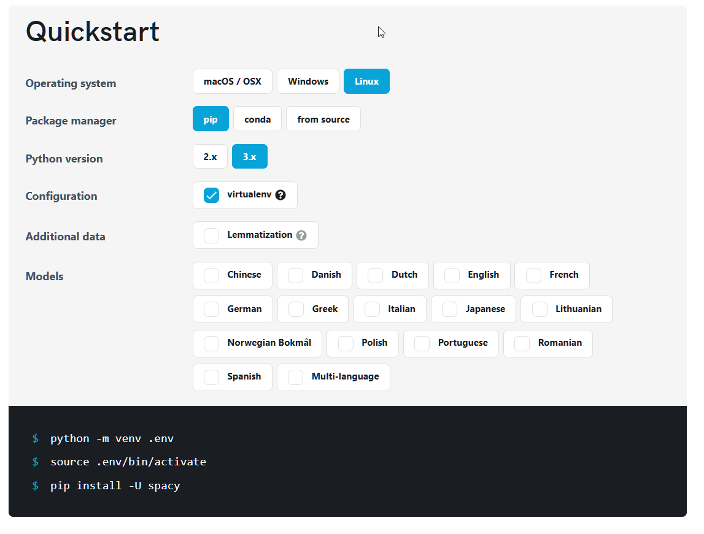
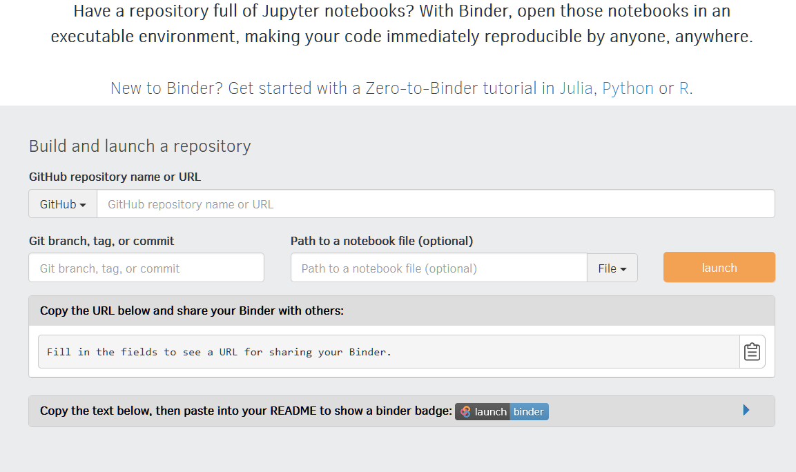

[][gitter]

# More about faas.ovh

+ [demo online - www.faas.ovh](https://www.faas.ovh/)

+ [faas project on github](https://github.com/faas-ovh/www)

+ [another github projects](https://github.com/faas-ovh)

+ [logo faas](https://logo.faas.ovh/)

## TODO:
+ bash script generator for full deployment by console
    + create one file with all bash commands
+ docker generator
    + from docker to faas
    + from faas to docker
    
+ yaml file of settings generator (from form values)
    + create examples
    + create patterns, models

buttons
https://getbootstrap.com/docs/4.0/components/buttons/

## Script generator

https://spacy.io/usage

## binder
https://mybinder.org

Have a repository full of Jupyter notebooks? With Binder, open those notebooks in an executable environment, making your code immediately reproducible by anyone, anywhere. 

## Benefits of FaaS

+ Increased developer productivity and faster development time
+ Not responsible for server management
+ Easy to scale and horizontal scaling is managed by the platform
+ Only pay for or consume resources when necessary
+ Functions can be written in almost any programming language

### Examples of similiar solutions

We tested lots of platforms, like Kubeless, OpenWhisk, OpenFaaS and Fission, and I must say that all of them performed quite well. In the end though, the one that scored the best in terms of our objectives was OpenFaaS, so we decided to use it as the reference for this blog post

https://www.netlify.com

## OpenFaaS
OpenFaaS – a Kubernetes-native FaaS platform
Deploying a FaaS platform on OVH Managed Kubernetes using OpenFaaS
https://github.com/openfaas/faas

Technically, OpenFaaS is composed of several functional blocks:

    The Function Watchdog. A tiny golang HTTP server that transforms any Docker image into a serverless function
    The API Gateway, which provides an external route into functions and collects metrics
    The UI Portal, which creates and invokes functions
    The CLI (essentially a REST client for the API Gateway), which can deploy any container as a function
    

## fission
Fast and Simple Serverless Functions for Kubernetes
https://fission.io
https://github.com/fission/fission
 

## kubeless

Kubernetes Native Serverless Framework 
https://github.com/kubeless/kubeless
https://kubeless.io/

## OpenWhisk
Apache OpenWhisk is an open source serverless cloud platform 
https://openwhisk.apache.org/
https://github.com/apache/openwhisk

https://aws.amazon.com/de/cloud9/
https://ace.c9.io/

## Run Service on linux

Note if you're new to Unix: 
/var/www/myapp/app.js should have 
#!/usr/bin/env node
 
on the very first line.

Copy your service file into the /etc/systemd/system.

Start it with systemctl start myapp.

Enable it to run on boot with systemctl enable myapp.

See logs with journalctl -u myapp

## [forever - npm](https://www.npmjs.com/package/forever)

    npm install forever -g

    forever start /path/to/yourApp.js

## screen
The screen will detach and survive you logging off. Then you can get it back back doing screen -r. Hit up the screen manual for more details. You can name the screens and whatnot if you like

    screen
    node myserver.js
    
>>CTRL-A then hit D

## libraries
https://highlightjs.org/download/

https://github.com/emmetio/textarea/blob/master/emmet.min.js
